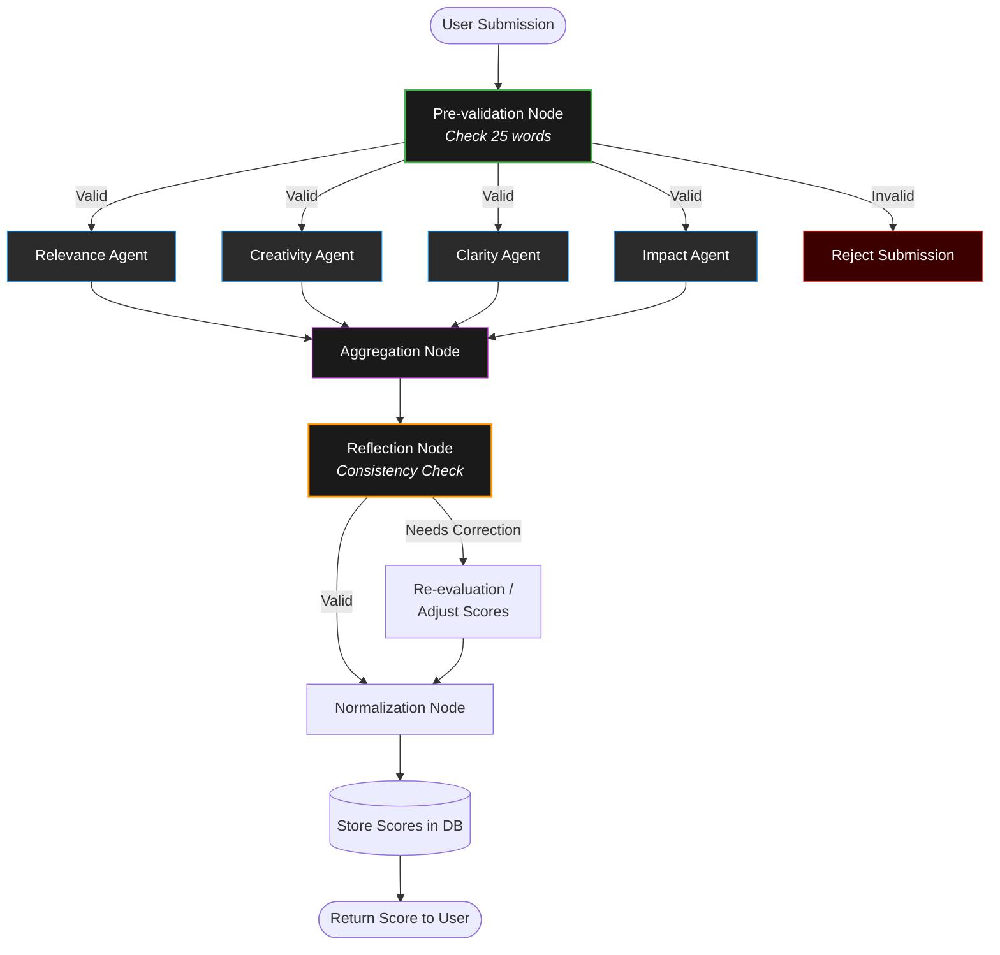

# AI Scoring System Documentation

This document outlines the architecture, design patterns, and operational strategy of the **AI Scoring System** used in the Big AI Challenge platform. 

---

## 🥇 Architecture Overview

The scoring system is built as a **Graph-based Orchestrator**, ensuring precise control over the flow of data and the execution of AI models.

- **Orchestration Engine**: [LangGraph](https://www.langchain.com/langgraph)
- **Workflow Pattern**: Parallel Execution + Aggregation + Reflection (PAR)
- **Monitoring & Observability**: [LangSmith](https://smith.langchain.com/) for full lifecycle tracing of AI events.
- **Operational Strategy**: **Controlled Workflow**. Unlike fully autonomous agents that may loop indefinitely or deviate from the task, this system follows a strictly defined state machine where every transition is programmed and monitored.

---

## 🏗️ System Workflow

The following diagram illustrates the lifecycle of a user submission through the AI evaluation graph.

---

## 📑 Node Descriptions

### 1. Pre-validation Node
The entry point of the graph. It performs rigid structural checks before any LLM resources are consumed.
- **Constraint**: Exactly 25 words.
- **Outcome**: Failures are immediately routed to `Reject Submission`, bypassing the scoring logic to save costs and maintain data integrity.

### 2. Specialized Evaluation Agents (Parallel Branching)
The system fans out into four specialized agents, each focusing on a specific dimension of the submission. This parallelization ensures that each agent has a focused prompt ("System Message") which reduces hallucination and improves accuracy.

| Agent | Focus Area |
| :--- | :--- |
| **Relevance** | Does the content directly answer the prompt? |
| **Creativity** | Originality, use of metaphors, and unique perspective. |
| **Clarity** | Grammar, structure, and ease of understanding. |
| **Impact** | Emotional resonance and effectiveness of the 25-word limit. |

### 3. Aggregation Node
Collects the JSON outputs from all four parallel agents. It resolves potential data format discrepancies and prepares a unified state for the reflection phase.

### 4. Reflection Node
A critical quality control layer. Instead of blindly accepting the agents' outputs, this node performs a "Consistency Check."
- **Logic**: If the Creativity Agent gives a 100/100 but the Clarity Agent reports the content is unintelligible, the Reflection Node flags a conflict.
- **Path**: Routes to `Adjust Scores` if anomalies are detected (discrepancy > 50 points).

### 5. Normalization & Persistence
Ensures all scores are mathematically aligned to the platform's leaderboard standards (e.g., scale of 0-100) and commits the final result to the PostgreSQL database.

---

## 💡 Key Design Decisions

> [!IMPORTANT]
> **Observability with LangSmith**
> Every node in the graph is wrapped in the `@traceable` decorator. This allows us to inspect the raw prompts and JSON responses of each sub-agent in real-time, facilitating rapid prompt engineering and regression testing.

> [!TIP]
> **Resource Efficiency**
> By running agents in parallel, we reduce the total Wall-to-Wall latency of the request. The Pre-validation node also prevents unnecessary API costs on invalid submissions.

---

## 🛠️ Implementation Specs
- **Engine**: Python / FastAPI
- **Graph Core**: `langgraph.graph.StateGraph`
- **Memory**: `langgraph.checkpoint.MemorySaver` for thread-safe state persistence.
- **Models**: Configurable via `.env` (variable `LLM_MODEL`). Supports:
  - **Groq**: `llama-3.3-70b-versatile`
  - **Ollama**: `gemma2`, `llama3.2`
  - **Gemini**: `gemini-1.5-flash`

