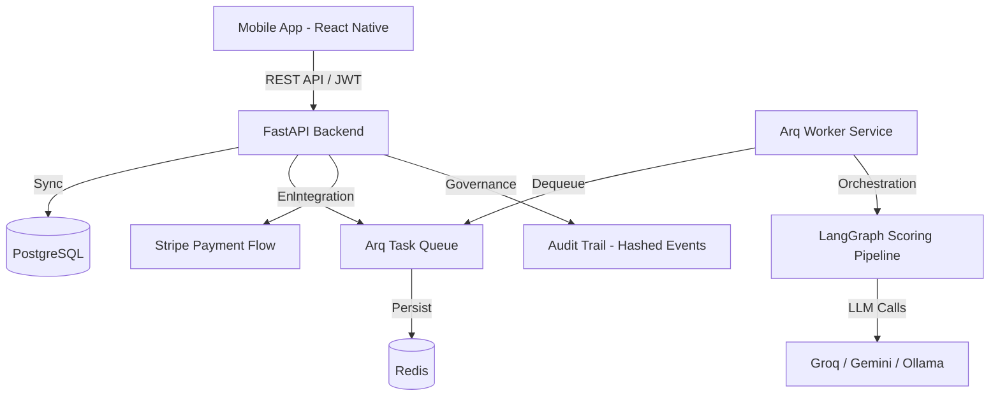

# BigSkillChallenge: Full Platform Architecture Review

## 1. System Overview
The BigSkillChallenge is a high-stakes, skill-based competition platform designed to handle up to 400,000 entries. The architecture is built on a modern stack: **FastAPI (Python)**, **PostgreSQL**, **Redis**, **React Native (Expo)**, and **LangGraph (AI)**.

### Architecture Diagram (High-Level)

---

## 2. Component Analysis

### A. Backend Pipeline
*   **Engine**: FastAPI provides high-performance asynchronous request handling.
*   **Persistence**: PostgreSQL serves as the source of truth for users, competitions, entries, and scores.
*   **Reliability**: Submissions are validated and persisted immediately. Scoring is decoupled via a **persistent Redis task queue (Arq)**. This ensures that even if the API server restarts, no scoring tasks are lost.
*   **Auto-Infrastructure**: The backend automatically detects missing local instances of PostgreSQL or Redis and attempts to start them via Docker Compose during application startup.

### B. AI Adjudication
*   **Framework**: LangGraph is used to implement a multi-node scoring graph.
*   **Logic**: Entries are scored in parallel across four dimensions (Relevance, Creativity, Clarity, Impact).
*   **Refinement**: A "Reflection" node detects conflicts or inconsistencies, triggering an "Adjustment" node if necessary before final "Normalization."
*   **Determinism**: Pinned parameters (`temperature=0`, `top_p=1`, `seed=42`) ensure consistent scoring for the same entry.

### C. Payment Flow
*   **Integration**: Native Stripe integration using `PaymentIntents`.
*   **Reliability**: Webhook-driven status updates ensure payment state is eventually consistent even if the mobile app loses connection.
*   **Governance**: Admin-only refund capability with full tracking in the database.

### D. Fraud Prevention & Compliance
*   **Rate Limiting**: `SlowAPI` prevents brute-force attempts and DoS.
*   **Eligibility**: A required quiz ensures participants have basic competency.
*   **Anti-Abuse**:
    *   10-entry cap per competition.
    *   Time-limited submission window (X minutes after passing quiz).
    *   Device ID tracking to prevent multi-account farming.
    *   Strict 25-word constraint (programmatic validation).

### E. Governance & Audit
*   **Audit Trail**: Each entry's lifecycle (submission -> scoring -> shortlisting) is logged with SHA-256 hashes for immutability verification.
*   **Versioning**: Prompt versions are recorded with every score to handle evolving AI models or rubric changes.

---

## 3. Risk Identification

| Risk | Impact | Status | Mitigation Strategy |
| :--- | :--- | :--- | :--- |
| **LLM Bottleneck** | Medium | Active | External APIs (Groq/Gemini) may hit rate limits at 400k entries. Implement a retry strategy with exponential backoff and LLM load balancing. |
| **Database Contention** | Medium | Active | Scoreboard calculations on 400k rows can be slow. Use materialized views or read-replicas for the scoreboard. |
| **AI "Jailbreaking"** | Low | Active | Users may try to prompt-inject within their 25 words. The LangGraph reflection node should be tuned to detect non-compliant content. |

---

## 4. Recommended Cloud Architecture (AWS)

To support the target scale of 400,000 entries with high availability, the following cloud-native architecture is recommended:

### Architecture Justification
*   **Scalability**: Decoupling scoring into SQS/Lambda (or Elasticache/ECS) allows the system to absorb massive spikes in submissions without affecting API responsiveness.
*   **Reliability**: RDS Aurora Multi-AZ provides the necessary performance and failover capabilities for a high-stakes competition.
*   **Performance**: CloudFront and WAF protect the origin and reduce latency for global participants.

### Proposed Stack
*   **Compute**: **AWS ECS (Fargate)** for the FastAPI and Arq Worker containers.
*   **Database**: **Amazon RDS (PostgreSQL/Aurora)** with a dedicated Read Replica for the scoreboard.
*   **Task Queue**: **Amazon ElastiCache (Redis)** for persistent job management.
*   **Storage**: **S3** for any static assets or exported audit logs.
*   **Security**: **AWS WAF** for bot protection and **Secrets Manager** for Stripe/AI keys.
*   **Monitoring**: **Amazon CloudWatch** + **Sentry** for real-time error tracking.

---

## 5. Summary
The architecture has been hardened with the transition to **persistent background tasks using Redis**. This resolves the primary risk of data loss during high-concurrency submission windows. The platform is now better positioned for scaling toward the **400,000-entry milestone**, with managed cloud services for database and queue scaling being the final piece of the production roadmap.
