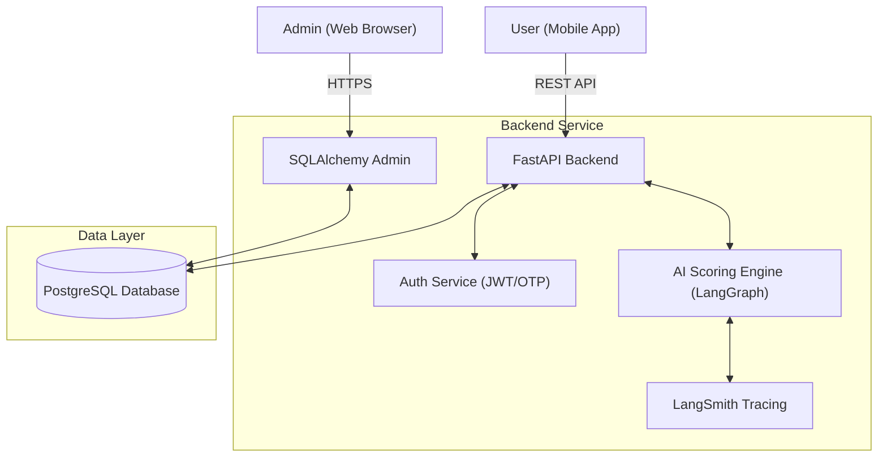
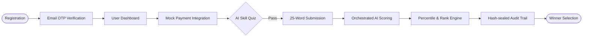

# Big AI Challenge - MVP Platform

The **Big AI Challenge** is a mobile-first platform where users can register, participate in creative competitions, submit exactly 25-word responses, and receive deterministic AI-based scoring. This repository contains both the mobile application built with React Native (Expo) and the backend service built with FastAPI and PostgreSQL.

## 🏗 System Architecture

The project is split into two distinct directories to separate concerns:

1. **`mobile/`**: The frontend React Native application designed with a premium neon-glassmorphism theme. Features custom hero animations, interactive countdowns, and a secure submission pipeline.
2. **`backend/`**: The FastAPI-powered API, exposing endpoints for User Authentication (JWT), Competitions, Payment mocks, Submissions, and the Orchestrated AI Scoring Engine.
3. **`admin/`**: Integrated SQLAlchemy Admin panel to manage the competition ecosystem, evaluate winners, and monitor real-time statistics.
4. **Database**: A PostgreSQL instance (UUID-based schema) for robust data persistence and relational integrity.

### 🏗 Architecture Diagram



---

## 🚀 Quick Start Guide

### 1. Starting the Backend (FastAPI & PostgreSQL)

The backend runs on **Python 3.10+** and uses **Docker Compose** to manage the PostgreSQL database.

```bash
# Navigate to the backend directory
cd backend

# Create your .env file
cp .env.example .env
# Edit .env and add your details (especially SMTP for OTP and LangSmith keys)

# Ensure PostgreSQL is ready:
./scripts/ensure_postgres.sh

# Create and activate a Python virtual environment
python3 -m venv venv
source venv/bin/activate

# Install dependencies
pip install uv
uv pip install -r requirements.txt

# Start the FastAPI server
uvicorn app.main:app --reload --host 0.0.0.0 --port 8000
```
> The API will be available at `http://localhost:8000`.
> The **Admin Panel** is available at `http://localhost:8000/admin`.
> - **Default Admin**: `admin@bigskillchallenge.com` / `admin123_change_me`

### 2. Starting the Mobile Application (React Native / Expo)

```bash
# Navigate to the mobile directory
cd mobile

# Install dependencies
npm install

# Create mobile env
cp .env.example .env
# Set EXPO_PUBLIC_API_URL=http://<your-lan-ip>:8000/api/v1

# Start Expo
npx expo start
```

---

## 🔄 Project Workflow



## 🛠 Feature Scope

- **Advanced AI Scoring (LangGraph)**:
  - Parallel evaluation of `Relevance`, `Creativity`, `Clarity`, and `Impact`.
  - **Reflection Node**: Detects scoring divergence and triggers an "Adjustment" node for harmonization.
  - **LangSmith Integration**: Full tracing of every scoring event for debugging and quality monitoring.
  - **Multi-Provider Support**: Seamlessly switch between local Ollama, Groq, and Gemini.
- **Percentile & Ranking Engine**: Real-time calculation of user performance against the entire competition pool.
- **Immutable Audit Trails**: Every submission generates a hash-sealed timeline of events (Submission -> AI Scoring -> Shortlisting) for transparency.
- **AI-Focused Quiz Module**: 50+ curated questions on Agentic AI, RAG, MCP, and GenAI architectures to ensure a high-skill participant pool.
- **Premium UI/UX**:
  - Dark-mode glassmorphism with neon accents (`#00F0FF`).
  - Hero sections with animated imagery and real-time countdowns.
  - Native hooks to prevent copy-pasting on submission screens.
- **Secure Admin Dashboard**: 
  - Real-time statistics on participation and scores.
  - Manual shortlisting and winner selection tools.

## 📋 Completed Development

- [x] **Rebranded to Big AI Challenge** with updated prize details (1-Year OpenAI Subscription).
- [x] **LangGraph Orchestrator** with parallel nodes and reflection logic.
- [x] **LangSmith Tracing** integration for AI pipeline observability.
- [x] **Percentile Response Schema** and ranking logic in backend.
- [x] **Immutable Audit Trails** using SHA-256 hash sealing for submission events.
- [x] **Enhanced Email Flow** with state-managed verification status.
- [x] **AI-Themed Quiz** seeded with 50+ expert-level questions.
- [x] **Premium Landing Screen** with hero imagery, staggered animations, and trust indicators.
- [x] **SQLAlchemy Admin** with restricted permissions and statistical dashboard.
- [x] **Mobile State Management** using Context API for cross-screen persistence.
- [x] **Paste-Blocking Hooks** implemented on creative submission screens.

