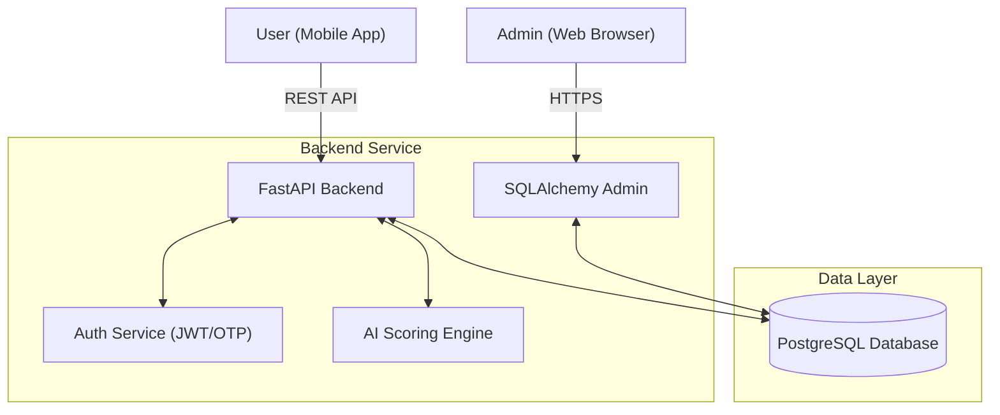
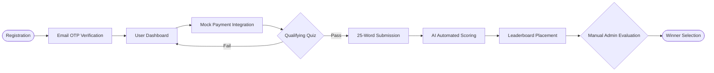

# Big Skill Challenge - MVP Platform

The **Big Skill Challenge** is a mobile-first platform where users can register, participate in creative competitions, submit exactly 25-word responses, and receive deterministic AI-based scoring. This repository contains both the mobile application built with React Native (Expo) and the backend service built with FastAPI and PostgreSQL.

## 🏗 System Architecture

The project is split into two distinct directories to separate concerns:

1. **`mobile/`**: The frontend React Native application designed mimicking the client prototype (dark glassmorphism theme). It communicates with the backend via RESTful APIs using Axios.
2. **`backend/`**: The FastAPI-powered API, exposing endpoints for User Authentication (JWT), Competitions, Payment mocks, Submissions, and the AI Scoring Engine.
3. **`admin/`**: Integrated SQLAlchemy Admin panel to manage the competition ecosystem, evaluate winners, and monitor scores.
4. **Database**: A PostgreSQL instance containerized via Docker for data persistence.

### 🏗 Architecture Diagram



---

## 🚀 Quick Start Guide

### 1. Starting the Backend (FastAPI & PostgreSQL)

The backend runs on **Python 3.10+** and uses **Docker Compose** to manage the PostgreSQL database.

```bash
# Navigate to the backend directory
cd backend

# Create your .env file
cp .env.example .env
# Edit .env and add your details (especially SMTP for OTP emails)

# Start the PostgreSQL database using Docker
docker-compose up -d

# Create and activate a Python virtual environment
python3 -m venv venv
source venv/bin/activate  # On Windows, use `venv\Scripts\activate`

# Install dependencies (including aiosmtplib for emails)
pip install -r requirements.txt

# Start the FastAPI server (auto-creates DB tables on launch)
uvicorn app.main:app --reload --port 8000
```
> The API will be available at `http://localhost:8000`
> The interactive Swagger documentation is hosted natively at `http://localhost:8000/docs`.
> The **Admin Panel** is available at `http://localhost:8000/admin`.
> - **Default Admin Email**: `admin@bigskillchallenge.com`
> - **Default Admin Password**: `admin123_change_me`

### 2. Starting the Mobile Application (React Native / Expo)

The frontend uses Expo to ensure a fast, robust mobile development timeline. You will need **Node.js** and **npm** installed.

```bash
# Navigate to the mobile directory
cd mobile

# Install NPM dependencies
npm install

# Start the Expo development server
npx expo start
```
> You can run the app directly on your physical device by downloading the **Expo Go** app and scanning the provided QR code, or by pressing `a` to open it in an Android Emulator / `i` to open it in an iOS Simulator.

---

## 🔄 Project Workflow



## 🛠 Feature Scope

Based on the core prototypes, the MVP contains the following foundational scaffolding:

- **Authentication System**: Secure JWT-based user registration and login implementation mimicking the HTML tabs.
- **OTP Verification**: Email-based verification flow (SMTP) to ensure user authenticity during registration.
- **Competition Flow**: Secure API structure outlining eligibility checks and active entry points.
- **Mock Payments**: Payment integration layer ready to be substituted with Stripe / Razorpay logic upon production launch.
- **25-Word LangGraph AI Scoring System**:
  - Validates entries perfectly matching the 25-word limit before AI inference to ensure constraints are respected.
  - Powered by a **LangGraph Orchestrator** leveraging a Parallel + Aggregation + Reflection (PAR) workflow pattern.
  - Four sub-agents evaluate `Relevance`, `Creativity`, `Clarity`, and `Impact` concurrently, with an automated consistency and reflection check for maximum deterministic quality.
  - Utilizes dynamic provider injection via `ai_adapter.py` seamlessly integrating local **Ollama** models, remote free-tier **Groq** endpoints, and production-ready **Gemini** providers. All providers can have their specific model names configured globally via the `LLM_MODEL` environment variable.
  - See the [detailed documentation](file:///mnt/data/sreekumar/projects/AgenticAI/BigSkillChallenge/AI_SCORING_SYSTEM.md) for deeper workflow details.
- **Aesthetic System Layout**: React Native constants configuring `linear-gradients`, `#F59E0B` CTA buttons and translucent glass borders.
- **Admin Dashboard**:
  - Secure **sqladmin** dashboard for manual evaluation of winners.
  - Features real-time **Leaderboard** viewing sorted by top AI scores.
  - Capabilities to manage `Users`, `Competitions`, `Questions`, and `Entries`.

## 📋 Completed Development

- [x] Implement SMTP-based OTP email verification.
- [x] Complete robust Redux / Context API State management in React Native for active cross-screen memory.
- [x] Connect absolute production API keys inside the backend `.env`.
- [x] Map the exact countdown interval logic mapping to the explicit 30-second localized quiz states (`07-quiz.html`).
- [x] Implement Paste-Blocking behavior hooks purely natively on the React `SubmissionScreen`.
- [x] Fix user registration to correctly save `first_name` and `last_name`.
- [x] Implement **SQLAlchemy Admin Panel** with secure authentication.
- [x] Create **Leaderboard** view for top scores and manual winner selection.
- [x] Integrate **LangGraph AI Orchestrator** for rigorous, parallel submission scoring across local Ollama, Groq, and Gemini LLMs.
